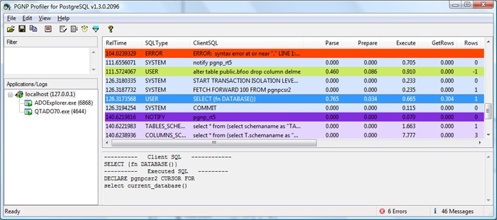
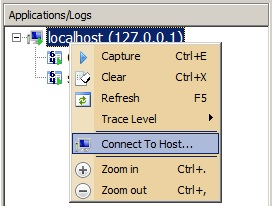
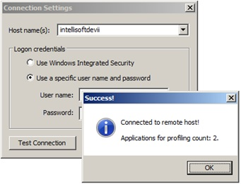
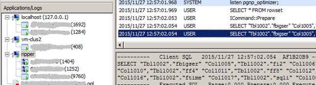

# pgnprofiler
Open source version of Intellisoft's PGNProfiler

## Purpose

Need an efficient tool to collect trace/profiling info from Intellisoft OLE DB Provider for PostgreSQL. The tool should be able to read very long traces from Windows applications and Services (32- and 64-bit), change logging levels, filter for errors, store traces to files, and display previously stored files. It has advanced features like injecting itself into another computer where PGNP was not installed and collecting a remote trace. It supports light and dark themes. Etc.

### Prerequisites

Boost 1.70 with chrono, date_time, interprocess, regex installed into C:\Program Files (x86). Boost should be compiled for static linking.

## Compilation

The project compiles with Visual Studio 2022 Community Edition. Open/add file src/PGNProfiler.vcxproj.

## History

I solely created the PGNProfiler in 2009. I got inspiration from another similar tool that I contributed a few years before. That other tool was written in Delphi 6/7 (Pascal). It provided me with good idea what is expected from a log viewer/tracer.

## User interface explained

There are four main panels in the profiler window:



### Filter panel
**Filter panel** allows user to enter text criteria for filtering out the SQL trace.

### Applications/Logs panel
**Applications/Logs** panel contains tree-list of computer hosts, applications, and log files. The tree items have indicators such as trace collection in progress, closed process, and 32- or 64-bit.

### Messages panel
**Messages panel** display columns with statement time, SQL text, profiler counters, etc. Columns contain following information:

   *AbsTime* (or *RelTime*) is first column that displays either absolute or relative time. User can click "Time format" button on the toolbar to toggle between AbsTime and RelTime;

   *SQLType* – displays SQL type, i.e.:

      USER       statements sent by the user application to PGNP provider
      SYSTEM     provider generated statements
      NOTIFY     schema change notifications sent to or received from Postgres
      ERROR      error condition in the provider
      xxx_SCHEMA statement generated by the provider to support corresponding OLEDB schema

   *ClientSQL* – displays either SQL from user application or generated by the provider;

   *Parse*, *Prepare*, *Execute*, *GetRows* – time in milliseconds spent by provider to parse, prepare, execute statement and to read rows from database server;

   *Rows* – number of rows read or affected during execution of the SQL;

   *Database*, *User* – database and user name for the connection;

   *PID* – process ID of the application that issued the message;

   *SessId* – logical OLEDB session ID, it can be used to distinguish between connections made from the same application;

   *CmdId* – logical OLEDB command ID, reserved for future, can be used to distinguish different commands in the same session;

   *CursorMode* – displays *Forward Only* for ADO client cursor or *Can scroll backwards* – for ADO server cursor;

   *Application* – application name and PID, i.e. origin of the message;

   *CmdType* – statement type, e.g. SELECT, UPDATE, INSERT, DELETE, CREATE xxx, ALTER, SET, SHOW, DROP xxx, PROCEDURE, INTERNALPROC, START, COMMIT, ROLLBACK, NOTIFY, COPY, etc.

### Details panel
**Details panel** on the bottom displays detailed SQL text for the messages selected in *Messages panel*. For a selected message it can display one of or both *Client SQL* and *Executed SQL*. *Client SQL* displays the statement text sent by a user application. *Executed SQL* displays statement sent by PGNP provider to database. *Client SQL* and *Executed SQL* can be different. Latter displays parameter values, e.g.:
```
   ----------   Client SQL   ------------
   UPDATE tbl SET article=? WHERE id=?
   ----------   Executed SQL   ---------
   update tbl set article=[DBTYPE_WSTR,*Nexus12*] where id=[DBTYPE_I4,2000]
```

## User actions in the PGNProfiler
| Action             | How-to                                    |
|--------------------|-------------------------------------------|
| Start capture      | Select localhost, host or an application in *Application/Logs* panel and click Capture button in the toolbar. |
| Stop/pause capture | Select localhost, host or an application in *Application/Logs* panel and click Pause button in the toolbar. |
| Remove application from the list | An application can be removed from the list only if it terminated, i.e. has "red" indicator icon. Click Clear button in the toolbar. |
| Start or stop filtering | Press "filter" button in the toolbar. |
| Toggle between absolute and relative time | Click "clock" button in the tolbar. |

## Collecting trace from remote computers
The PGNProfiler supports receiving event traces from remote computers (not only from localhost). In order to connect to a remote system, right-click mouse in the Applications panel:  
<p align="center"></p>

In the Connection Settings dialog enter a remote computer name or an IP address, and (optionally) user name and password. Then click Test Connection button. If connection test succeeds, the message will also display the number of applications available for profiling:  
<p align="center"></p>

The Host name(s) combo-box keeps history of connections, and can be used to quickly choose one of the previous connections.
Click OK button to open connection to the remote host. Then click Capture button in the toolbar on top in order to start collecting trace. The PGNP Profiler can look like the following:  
<p align="center"></p>

The list of applications on remote hosts will refresh automatically every 10 seconds, similarly to the list on the local host. The closed applications will be marked with the “red bar” sign, and the new applications will be appended to the list. The list can be refreshed manually by right-clicking mouse on the remote host item, and selecting Refresh menu item, or by pressing F5.

*Note: The PGNProfiler copies itself to and runs on remote host as Windows service in order to obtain list of applications available. When the Profiler closes, it performs cleanup. However, if physical connection broke, or some other irregular termination occurred, manual cleanup might be needed on the remote host computer. Use the following VB script for the cleanup:*
```
' The script stops and deletes "PGNProfiler" services
Set objWMIService = GetObject("winmgmts:" & "{impersonationLevel=impersonate}!\\.\root\cimv2")
Set colListOfServices = objWMIService.ExecQuery ("Select * from Win32_Service ")

Set shell = CreateObject("WScript.Shell")
Set fso = WScript.CreateObject("Scripting.FileSystemObject")

For Each objService in colListOfServices
	If Left(objService.name,11) = "PGNProfiler" then
		If vbYes = Msgbox("Delete " & objService.name & "?", vbYesNo, "Delete Service") Then		
			shell.Run "sc stop " & objService.name, 0, True
			shell.Exec "sc delete " & objService.name
			filename = shell.ExpandEnvironmentStrings("%WinDir%") & "\" & objService.name & ".exe"
			fso.DeleteFile(filename), DeleteReadOnly
		End if
	End if
Next

Set shell = Nothing
Set fso = Nothing

wscript.echo "Done!"
```

## Filtering messages in the trace
Filter pane accepts numeric, string and Boolean expressions on variables of a message. The variables names are the same as column names in “Messages panel”, i.e. clientsql, execute, etc. (see the columns list and descriptions above).
There are several preconfigured filters available by right mouse click in the Filter panel: 

   “ClientSQL Like…” – display SQL messages according to the regular expression, e.g.
      clientsql ilike ‘select(.)+’

   “Show Errors” – display error messages only, i.e. 
      SQLType = ERROR

   “Hide System” – hide any “system”, i.e. the provider generated messages, i.e. 
      SQLType <> SYSTEM

   “ExecuteTime > 1ms” – display statements with execution time over 1 millisecond, i.e. 
      execute > 1.0

   “Schema Alterations” – display only schema alteration messages such as DROP TABLE tbl, i.e.
      (ClientSQL ilike 'Alter(.)+' || ClientSQL ilike 'Create(.)+' || ClientSQL ilike 'Drop(.)+')
      && SQLType != ERROR

   “Stored Procedures and Notifications” – display only stored procedures calls and notifications sent and received, i.e
      CMDType == PROCEDURE || CMDType == INTERNALPROC || CMDType == NOTIFY
Following operators can be used in the expressions:

| Operator | Description |
|----------|-------------|
| +	| Add variables or numeric constants |
| -	| Subtract variables or numeric constants, or negate a value |
| *	| Multiply variables or numeric constants |
| /	| Divide variables or numeric constants |
| >	| Greater than |
| >= | Greater than or equal to |
| <	| Less than |
| <= | Less than or equal to |
| != | Not equal |
| <> | Not equal |
| = | Equal |
| == | Equal |
| ! | Logical NOT |
| (…) | Sub-expressions grouping |
| && | Logical AND |
| \|\| | Logical OR |
| like | Case sensitive regular expression LIKE |
| ilike | Case insensitive regular expression LIKE |
| not like | Case sensitive regular expression NOT LIKE |
| not ilike | Case insensitive regular expression NOT LIKE |

Like/ILike operators are based on boost regular expressions evaluation engine. For more details read article: http://www.boost.org/doc/libs/1_40_0/libs/regex/doc/html/boost_regex/syntax/perl_syntax.html (“Perl Regular Expression Syntax”).
Following constants can be used in expressions when comparing a variable to a constant:

| Variable | Constant |
|----------| ---------|
| SQLType | USER |
| | SYSTEM |
| | NOTIFY |
| | ERROR |
| | COLUMNS_SCHEMA |
| | INDEXES_SCHEMA |
| | TABLES_SCHEMA |
| | CATALOGS_SCHEMA |
| | FOREIGN_KEYS_SCHEMA |
| | PRIMARY_KEYS_SCHEMA |
| | PROCEDURE_COLUMNS_SCHEMA |
| | PROCEDURE_PARAMETERS_SCHEMA |
| | PROCEDURES_SCHEMA |
| CMDType | SELECT |
| | INSERT |
| | UPDATE |
| | DELETE |
| | CREATE DATABASE |
| | CREATE TABLE |
| | CREATE VIEW |
| | CREATE INDEX |
| | CREATE FUNCTION |
| | ALTER |
| | SET |
| | SHOW |
| | DROP DATABASE |
| | DROP TABLE |
| | DROP VIEW |
| | DROP INDEX |
| | DROP FUNCTION |
| | PROCEDURE |
| | INTERNALPROC |
| | START TRANSACTION |
| | COMMIT |
| | ROLLBACK |
| | NOTIFY  |
| | COPY |
| CursorMode | Forward only |
| | Can scroll backwards |

## Format of PGL file

| Size | Value | Description |
|------|-------|-------------|
| 12 | PGNProfiler\1 | File header, same for all files. Single byte after ‘PGNProfiler’ is format version number. |
| 4 | Integer N | Total number of messages. |
| 4 | Integer E | Number of errors. This number is only for convenience of displaying PGL file in viewer. It is for avoiding calculation of errors count. |
| N*4 | | Array of 4-byte integers representing messages and errors sizes. Messages and errors in format described in separate tables below. The messages and errors are always 4-byte aligned by zeroes appended to the end. The array of sizes contains sizes including the alignment. |
| >4  | | Logger ID to Name value pairs. Logger ID is 4-byte integer used in messages and error to resolve into Logger Name (usually Process name). The list can have one or more pairs. Logger Name ends with \\0. |

### Message format

| Size | Value | Description |
|------|-------|-------------|
|4 | *number* | Logger ID |
|1 | 0 (TRC_NONE) | Trace type |
||1 (TRC_CLIENTSQL) |
||2 (TRC_SYSTEMSQL) |
||3 (TRC_NOTIFIES) |
||4 (TRC_ERROR) |
||5 (TRC_SCHEMA_COLUMNS) |
||6 (TRC_SCHEMA_INDEXES) |
||7 (TRC_SCHEMA_TABLES) |
||8 (TRC_SCHEMA_CATALOGS) |
||9 (TRC_SCHEMA_FOREIGN_KEYS) |
||10 (TRC_SCHEMA_PRIMARY_KEYS) |
||11 (TRC_SCHEMA_PROCEDURE_COLUMNS) |
||12 (TRC_SCHEMA_PROCEDURE_PARAMETERS) |
||13 (TRC_SCHEMA_PROCEDURES) |
||14 (TRC_SYS_SCHEMA) |
||15 (TRC_USER_SCHEMA) |
||16 (TRC_COMMENT) |
|1 | 0 (QT_NONE) | Command type |
||1 (QT_SELECT) |
||2 (QT_INSERT) |
||3 (QT_UPDATE) |
||4 (QT_DELETE) |
||5 (QT_CREATE_DATABASE) |
||6 (QT_CREATE_TABLE) |
||7 (QT_CREATE_VIEW) |
||8 (QT_CREATE_INDEX) |
||9 (QT_CREATE_FUNCTION) |
||10 (QT_ALTER) |
||11 (QT_SET) |
||12 (QT_SHOW) |
||13 (QT_DROP_DATABASE) |
||14 (QT_DROP_TABLE) |
||15 (QT_DROP_VIEW) |
||16 (QT_DROP_INDEX) |
||17 (QT_DROP_FUNCTION) |
||18 (QT_PROCEDURE) |
||19 (QT_INTERNAL_PROC) |
||20 (QT_START_TRANS) |
||21 (QT_COMMIT) |
||22 (QT_ROLLBACK) |
||23 (QT_NOTIFY) |
||24 (QT_COPY) |
|1 | 0 (FORWARD_ONLY) | Cursor type |
||1 (CANSCROLLBACKWARDS) |
||2 (VIRTUAL) |
|1 | 0 | License chip (deprecated after 1.2.8) |
|8 | FILETIME | Timestamp when the message was received |
|8 | FILETIME | Parse duration in microseconds |
|8 | FILETIME | Prepare duration in microseconds |
|8 | FILETIME | Execution duration in microseconds |
|8 | FILETIME | Data get operation duration |
|4 | *number* | Number of rows affected |
|2 | *number* | Session ID |
|2 | *number* | Command ID |
| 4+len	| | Client SQL length and text |
| 4+len	| | Executed Statement length and text |
| 4+len	| | Database name length and text |
| 4+len	| | User name length and text |

### Error format

| Size | Value |Description |
|------|-------|------------|
| 4	| | Logger ID |
| 1	| 4 (TRC_ERROR) | Trace type |
| 1 | – Same as in Message – | Command type |
| 1	| – Same as in Message – | Cursor type |
| 1 | License chip (deprecated after 1.2.8) |
| 8 | FILETIME | Timestamp when the message was received |
| 2	| *number* | Session ID |
| 2	| *number* | Command ID |
| 4+len	| | Database name length and text |
| 4+len	| | User name length and text |
| 4+len	| | Error length and text |

## Registry keys for advanced features

The following Registry keys in HKCU\SOFTWARE\INTELLISOFT\<id>\PGNPROFILER could be used to enable and configure various advanced features of the PGNProfiler. Where <id> is PGNP for Postgres and Greenplum products, and RSNP – for Redshift.

| Key  | Type  | Description |
|------|-------|-------------|
| ConnectToHostEnabled | DWORD | When key exists and set to 1, UI for connecting to remote hosts enabled. |
| MaxLogFileSize | String | Contains abbreviated string with maximum size of the .pgl file (current trace). When the maximum size is reached the current file is closed, and new file is created with the latest timestamp added to the name. Examples: "1K" -> 1000, "360M" -> 360'000'000, "2.6G" -> 2'000'000'000, "3T" -> 3'000'000'000'000, "0" -> 0 (infinite size). When missing key or empty value, then maximum size is 2^30. The size cannot be set smaller than 16777216. |

Note: more information can be found in the Intellisoft's Developers Manual and the Forum.

Note: I described the approach to the messages filtration here: https://www.codeproject.com/Articles/51386/Yet-Another-Concurrent-Expression-Evaluator.
